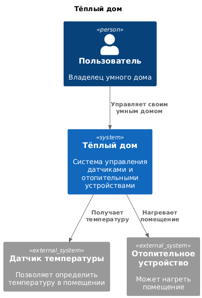
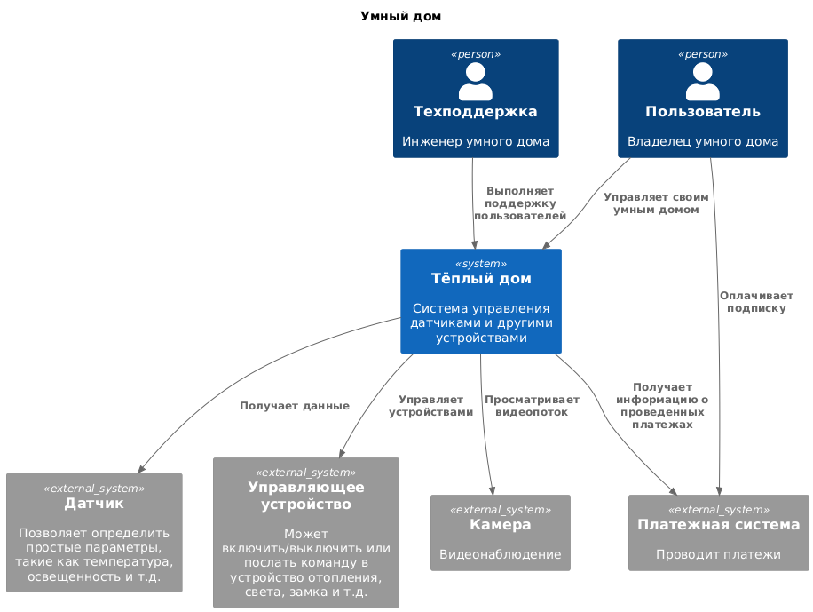
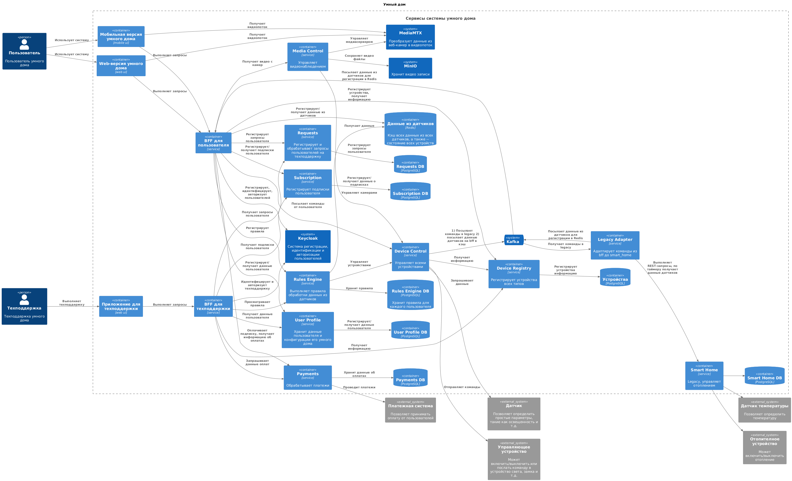
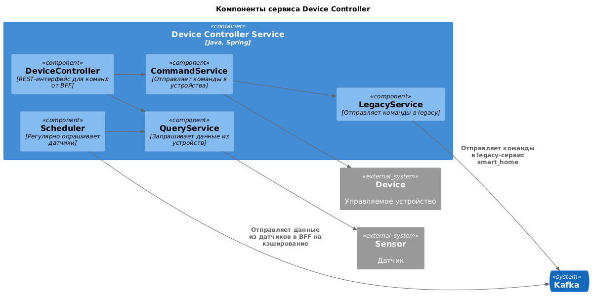
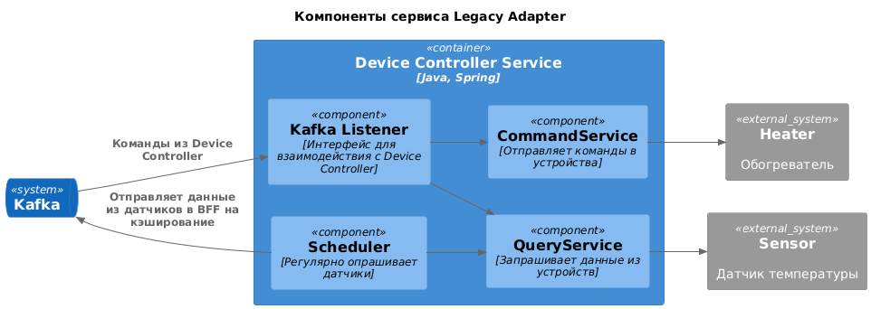
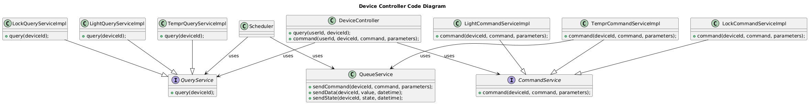
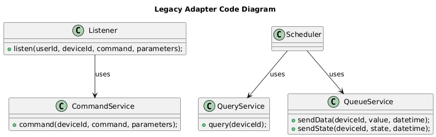
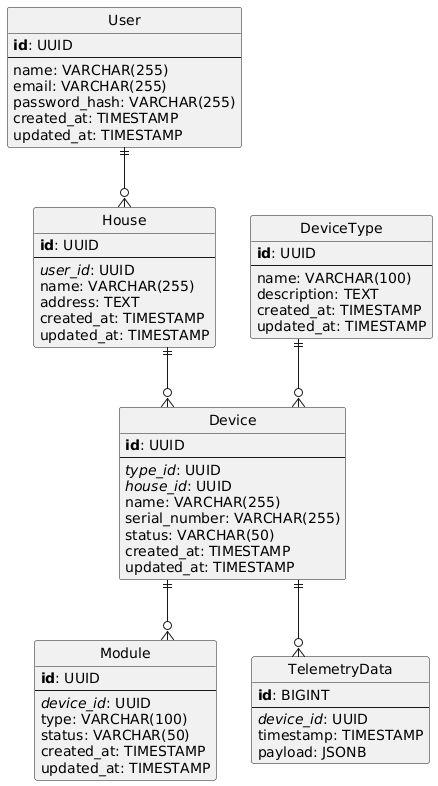

# Тёплый дом

# Задание 1. Анализ и планирование

### 1. Описание функциональности монолитного приложения

Система имеет следующий функционал:
  1) получить список устройств;
  2) получить данные от одного конкретного устройства;
  3) зарегистрировать устройство в системе;
  4) обновить информацию об устройстве;
  5) удалить информацию об устройстве;
  6) записать данные и статус в устройство для управления отоплением;
  7) получить данные о температуре по местоположению.

**Управление отоплением:**

- Пользователи могут управлять температурой в помещении при помощи устройств отопления, зарегистрированных в системе.
 
- Система поддерживает установление желаемой температуры, включение и выключение зарегистрированных устройств отопления.

**Мониторинг температуры:**

- Пользователи могут проверить данные с зарегистрированных датчиков температуры.

- Система поддерживает получение температуры как по конкретному датчику, так и по выбранной локации.

### 2. Анализ архитектуры монолитного приложения

Работающая система реализована как монолитный REST-сервис, написанный на Go с использованием БД PostgreSQL, имеет классическую слоистую структуру. Код очень простой, в нем нет аутентификации/авторизации, уведомлений о сбоях и иного сложного мониторинга состояния системы. Никак не реализовано масштабирование, балансирвка, ограничение количества запросов и т.д.

Сервис полностью синхронный. Он позволяет зарегистрировать устройства отопления и датчики температуры. При этом никак не разделяется принадлежность датчиков к каким бы то ни было пользователям.

Сервис вызывает датчики для получения информации из них или записи значений (команд). Всё это делается по REST-api. Эмулятор устройства реализован в приложении temperature-api.


### 3. Определение доменов и границы контекстов

#### Существующее решение
* Домен -- удалённое управление отоплением в доме.
* Контексты
  - реестр устройств  (регистрация и удаление)
  - управление устройствами отопления и датчиками температуры (чтение данных и отсылка команд)

#### Следующее решение
* Домен: управление подписками

  - поддомен: управление пользователями
    + контекст: регистрация пользователей
    + контекст: управление профилем пользователя (данные о физическом лице)
    + контекст: конфигурация системы пользователя на основе купленной подписки (какие устройства можно подключить)
    
  - поддомен: обработка платежей
    + контекст: продажа подписок
    
* Домен: управление умным домом
  - поддомен: управление отоплением
    + контекст: регистрация датчиков и отопительных устройств
    + контекст: управление датчиками и отопительными устройствами (посылка команд и считывание данных)

  - поддомен: управление прочими умными устройствами
    + контекст: регистрация умных устройств
    + контекст: управление умными устройствами
    + контекст: получение данных от умных устройств (телеметрия)

  - поддомен: видеонаблюдение
    + контекст: регистрация камер
    + контекст: просмотр видео с камер
    
* Домен: автоматизация
  - поддомен: создание умных правил
    + контекст: правила для умных датчиков
    + контекст: правила для видеонаблюдения
    
* Домен: поддержка

  - поддомен: работа с заявками
    + контекст: регистрация заявок
    + контекст: обработка поступивших заявок
    
  - поддомен: просмотр данных пользователя
    + контекст: просмотр профиля пользователя и его конфигурации

### **4. Проблемы монолитного решения**

- Отсутвие аутентификации и авторизации;
- Нет механизма обеспечения безопасности доступа к датчикам (каждый пользователь должен иметь доступ только к своим датчикам);
- Нет мониторинга и алертинга;
- Сильная связанность модулей внутри сервиса приводит к сложностям изменения отдельных модулей, т.к. зависимости могут сломать другие модули;
- Низкая отказоустойчивость, ошибка в любом компоненте может привести к отказу всей системы;
- Сложность поддержки и развития из-за монолитной кодовой базы;
- Завязанность на одну технологию: все модули системы реализованы на Go и должны быть и дальше разработаны на этом языке с использованием тех же самых версий библиотек;
- Невозможность масштабирования отдельных модулей системы, испытывающих нагрузку.

### 5. Визуализация контекста системы — диаграмма С4

#### Существующая система



#### Будущая система



# Задание 2. Проектирование микросервисной архитектуры

В этом задании вам нужно предоставить только диаграммы в модели C4. Мы не просим вас отдельно описывать получившиеся микросервисы и то, как вы определили взаимодействия между компонентами To-Be системы. Если вы правильно подготовите диаграммы C4, они и так это покажут.

**Диаграмма контейнеров (Containers)**



Основная техническая задача здесь -- интеграция с существующим legacy-решением. Здесь это реализовано с применением очереди очереди сообщений следующим образом.

*BFF* посылает команды на *Device Controller*, который знает, каким образом управлять известными ему устройствами: датчиками, лампами, замками, камерами. Если тип используемого устройства -- датчик температуры или устройство отопления, то *Device Controller* посылает сообщение в *Kafka*.

*Legacy Adapter* получает сообщение из *Kafka* и делает запрос на legacy-сервис smart_home.

Кроме того, *Legacy Adapter*, а также *Device Controller* регулярно опрашивают все датчики. Новые значения отправляются в *Kafka*, откуда их забирает *BFF* и регистрирует в *Redis*.

Когда приложение только стартует, и *Redis* не содержит данных из датчиков, *BFF* отправляет в *Device Controller* и *Legacy Adapter* через *Kafka* специальную команду на опрос всех датчиков.

**Диаграмма компонентов (Components)**





**Диаграмма кода (Code)**





# Задание 3. Разработка ER-диаграммы



# Задание 4. Создание и документирование API

### 1. Тип API

Укажите, какой тип API вы будете использовать для взаимодействия микросервисов. Объясните своё решение.

### 2. Документация API

#### 2.1. Device Control API

- [Device Controller API (OpenAPI)](https://editor.swagger.io/?url=https://raw.githubusercontent.com/dbushenko/architecture-pro-warmhouse/warmhouse/schemas/device-control-openapi.yaml)

#### 2.2. Legacy Adapter API

- [Legacy Adapter API (AsyncAPI)](https://studio.asyncapi.com/playground?url=https://raw.githubusercontent.com/dbushenko/architecture-pro-warmhouse/warmhouse/schemas/legacy-adapter-asyncapi.yaml)

# Задание 5. Работа с docker и docker-compose

Перейдите в apps.

Там находится приложение-монолит для работы с датчиками температуры. В README.md описано как запустить решение.

Вам нужно:

1) сделать простое приложение temperature-api на любом удобном для вас языке программирования, которое при запросе /temperature?location= будет отдавать рандомное значение температуры.

Locations - название комнаты, sensorId - идентификатор названия комнаты

```
	// If no location is provided, use a default based on sensor ID
	if location == "" {
		switch sensorID {
		case "1":
			location = "Living Room"
		case "2":
			location = "Bedroom"
		case "3":
			location = "Kitchen"
		default:
			location = "Unknown"
		}
	}

	// If no sensor ID is provided, generate one based on location
	if sensorID == "" {
		switch location {
		case "Living Room":
			sensorID = "1"
		case "Bedroom":
			sensorID = "2"
		case "Kitchen":
			sensorID = "3"
		default:
			sensorID = "0"
		}
	}
```

2) Приложение следует упаковать в Docker и добавить в docker-compose. Порт по умолчанию должен быть 8081

3) Кроме того для smart_home приложения требуется база данных - добавьте в docker-compose файл настройки для запуска postgres с указанием скрипта инициализации ./smart_home/init.sql

Для проверки можно использовать Postman коллекцию smarthome-api.postman_collection.json и вызвать:

- Create Sensor
- Get All Sensors

Должно при каждом вызове отображаться разное значение температуры

Ревьюер будет проверять точно так же.


# **Задание 6. Разработка MVP**

Необходимо создать новые микросервисы и обеспечить их интеграции с существующим монолитом для плавного перехода к микросервисной архитектуре. 

### **Что нужно сделать**

1. Создайте новые микросервисы для управления телеметрией и устройствами (с простейшей логикой), которые будут интегрированы с существующим монолитным приложением. Каждый микросервис на своем ООП языке.
2. Обеспечьте взаимодействие между микросервисами и монолитом (при желании с помощью брокера сообщений), чтобы постепенно перенести функциональность из монолита в микросервисы. 

В результате у вас должны быть созданы Dockerfiles и docker-compose для запуска микросервисов. 
